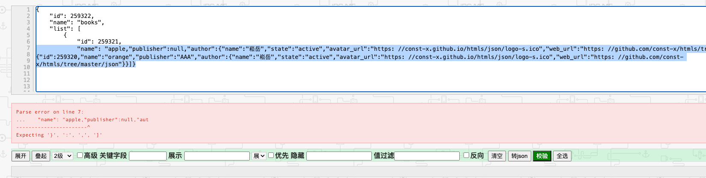
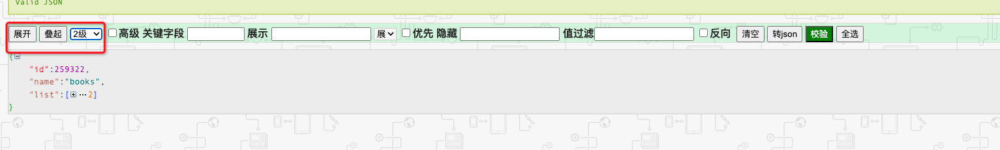
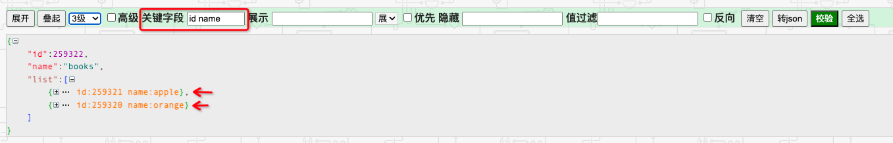
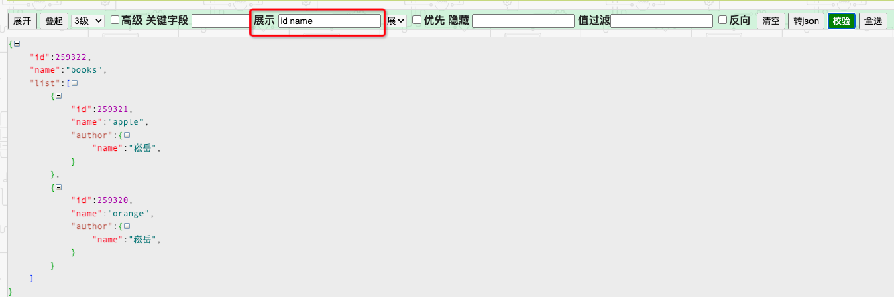
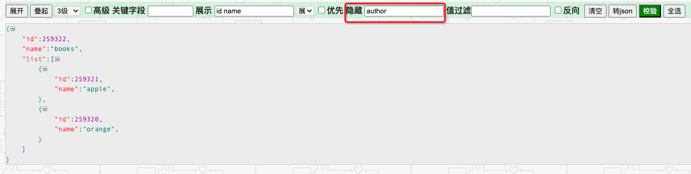
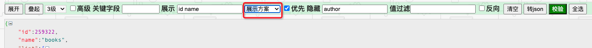
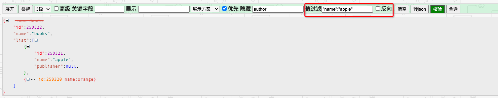
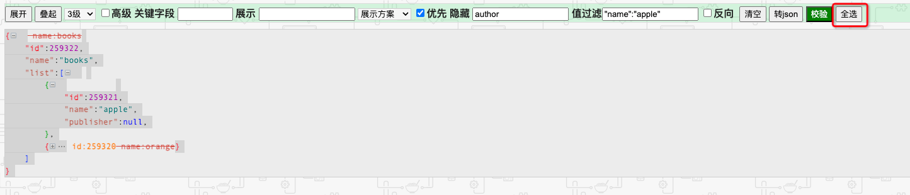
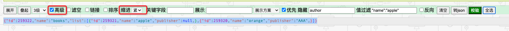
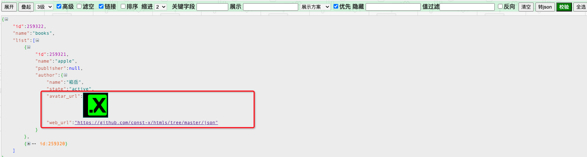

# JSON 

JSON 数据校验及快速处理工具

[快速使用](https://const-x.github.io/htmls/json/JSONFormater.htm)

## 数据校验
* 自动校验并提示错误信息

## 展开叠起 
*  支持全部展开 全部叠起 展开到指定层级

## 关键字段 
* 指定关键字段后,当相关内容折叠时 会在界面上展示关键字段对应的内容
* 支持多个关键字段 以空格分隔 默认关键字段为"id"

## 展示与隐藏
* 指定展示字段后,仅展示指定字段的内容
* 支持多个展示字段 以空格分隔 
   

* 指定隐藏字段后,对应字段的内容将不会展示
* 支持多个隐藏字段 以空格分隔
   

* 当同时满足展示字段和隐藏字段时 勾选优先将优先展示字段指定的内容
![img_5.png](img_5.png

* 可将展示字段存储为本地方案以快速过滤字段

## 数据过滤
* 支持根据具体字段过滤数据 被过滤的值将会添加删除线 
* 格式为 "key":"value",多组条件以空格分割
* 支持反向过滤

## 内容复制
* 点击全选可以选中处理后的内容 并且被过滤的内容及增强展示的内容不会被选中

* 可结合高级下 缩进选择"紧凑" 以获得压缩后的内容

## 高级
* 滤空 过滤掉值为null的字段
* 排序 按key值进行排序
* 链接 url和图片自动转换展示

